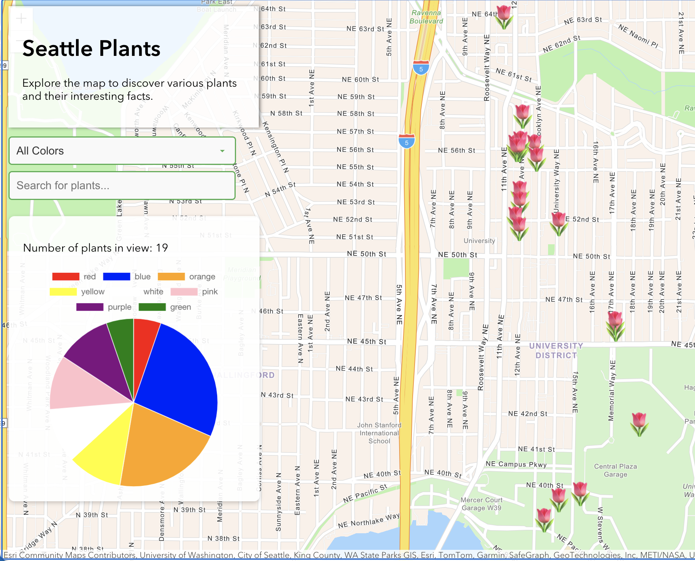

# Seattle Plants Web Map

Project Link: https://lenny400.github.io/seattleplants/

Seattle is often viewed as a bustling metropolis, with new skyscrapers seemingly appearing overnight. However, within this city lies a true urban jungle, where abundant greenery and diverse plant life weave through and envelop the landscape. Explore this web map to discover the rich diversity of fauna across the greater Seattle area.

<p align="center">
    
</p>

## Table of Contents

- [Description](#description)
- [Installation](#installation)
- [Features](#features)
- [Screenshots](#screenshots)
- [Contact](#contact)
- [Acknowledgements](#acknowledgements)

## Description

Seattle Plants is an interactive web application that allows users to explore different plants in the Seattle area. Users can search for plants in the database, filter by color, and view detailed information about each plant, including fun facts and photos. This project aims to enhance environmental awareness and encourage Seattle residents to explore the outdoors, and in turn fostering a greater appreciation for Seattle's unique plant life.

## Installation

To set up the project locally, follow these steps:

1. Clone the repository:
    ```sh
    git clone https://github.com/lenny400/seattleplants.git
    ```
2. Navigate to the project directory:
    ```sh
    cd seattleplants
    ```
3. Open the `index.html` file in your preferred web browser to view the application.

## Features

1. **Filter**: Use the filter dropdown to filter plants by color.
2. **Search**: Use the search bar to look for specific plants by name.
3. **View Details**: Click on a plant marker on the map to view detailed information and photos.

## Note

For best reader accessibility, make sure to press the Dock button (to the left of the X) to display the full popup!

<p align="center">
    
    
</p>

## Screenshots

<p align="center">
    
    <br>
    <i>The dynamic dashboard on the left updates with user interactions, reflecting statistics relevant to the current map view.</i>
</p>
<br>


<p align="center">
    
    <br>
    <i>Use the color filter dropdown menu to refine plant searches by their specific colors.</i>
</p>
<br>

<p align="center">
    
    <br>
    <i>Type plant names into the search bar to to quickly locate individual plants and access their detailed profiles.</i>
</p>

## Contact

Shawn Leonard - [LinkedIn](https://www.linkedin.com/in/shawn-leonard-004592217/) - sleo108@gmail.com

Portfolio: https://lenny400.github.io/portfolio-v2/

## Acknowledgements

- [ArcGIS JavaScript API](https://developers.arcgis.com/javascript/)
- [Chart.js](https://www.chartjs.org/)